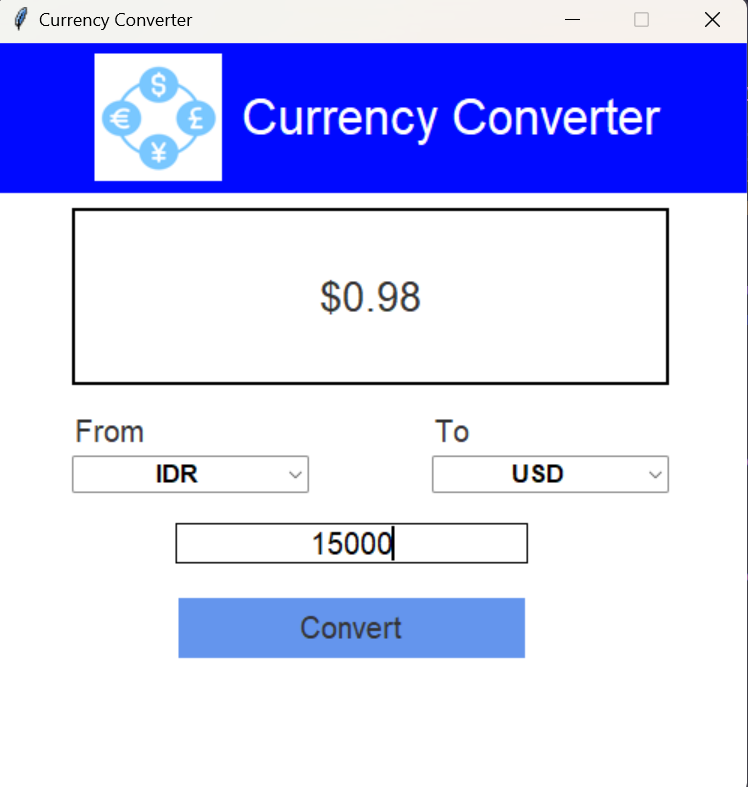

# Currency Converter
A simple currency converter application built using Python's Tkinter library for the graphical user interface, Python Imaging Library (PIL) for image handling, and integration with the RapidAPI for real-time currency conversion rates.

## Features 
- Convert between various currencies using [Rapid API](https://rapidapi.com/solutionsbynotnull/api/currency-converter18/), a real-time conversion rates.
- User-friendly graphical interface built using [Tkinter](https://docs.python.org/3/library/tkinter.html).
- Utilizes the [Python Imaging Library (PIL)](https://pypi.org/project/Pillow/) for logo handling.

## Prerequisites
- Python 3.x installed.
- Tkinter library for GUI (usually included with standard Python installations).
- Python Imaging Library (PIL) for image handling (`pip install pillow`).
- RapidAPI account with an active subscription and API key.

## Getting Started
1. Clone the repository (`git clone https://github.com/siriusberg/currency-converter`) and change directory to the folder (`cd currency-converter`).
2. Install required Python packages:
```
pip install tkinter
pip install pillow
```
3. Replace `config.API_KEY` in `main.py` with your RapidAPI key.
4. Run the application: `python main.py`

## Usage
1. Select the source currency and target currency from the dropdown lists.
2. Enter the amount you want to convert.
3. Click the "Convert" button to get the converted value.

## Preview

